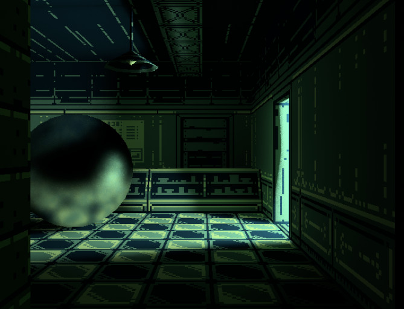
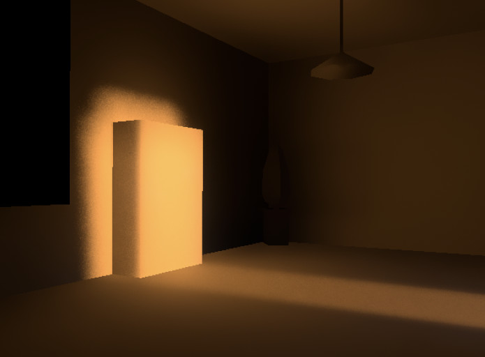

# Strolle

Strolle (from _strålspårning_) is an experimental real-time renderer with
support for global illumination:

<p align="center">
  
</p>

<p align="center">
  
</p>

Our goal is to create an engine that is able to produce a good-looking image on
a consumer GPU without having to rely on hardware ray-tracing capabilities.

Strolle comes integrated with [Bevy](https://bevyengine.org/), but can be also
used on its own (through `wgpu`).

Status: Work in progress, no official release yet.    
Platforms: Windows, Mac & Linux.

## Example

``` shell
$ cargo run --release --example demo
```

Shows a dungeon tech demo, as in the render above.

Use WASD to move and mouse to navigate the camera; extra controls include:

- F: Toggle flashlight,
- H/L: Adjust sun's azimuth,
- J/K: Adjust sun's altitude,
- T: Disable textures,
- 1: Switch camera back to the default mode,
- 2: Show direct lightning only,
- 3: Show indirect diffuse lightning only,
- 4: Show indirect specular lightning only,
- 9: Switch camera to a path-traced reference mode (slow),
- 0: Switch camera to Bevy's renderer,
- ;: Toggle camera's controls on/off - useful for taking screenshots.

Model thanks to:    
https://sketchfab.com/3d-models/low-poly-game-level-82b7a937ae504cfa9f277d9bf6874ad2

## Algorithms

Notable algorithms implemented in Strolle include:

- [ReSTIR DI](https://research.nvidia.com/sites/default/files/pubs/2020-07_Spatiotemporal-reservoir-resampling/ReSTIR.pdf),
- [ReSTIR GI](https://d1qx31qr3h6wln.cloudfront.net/publications/ReSTIR%20GI.pdf),
- [ReBLUR](https://link.springer.com/chapter/10.1007/978-1-4842-7185-8_49),
- [A Scalable and Production Ready Sky and Atmosphere Rendering Technique](https://sebh.github.io/publications/egsr2020.pdf).

## License

MIT License

Copyright (c) 2022-2023 Patryk Wychowaniec & Jakub Trąd
