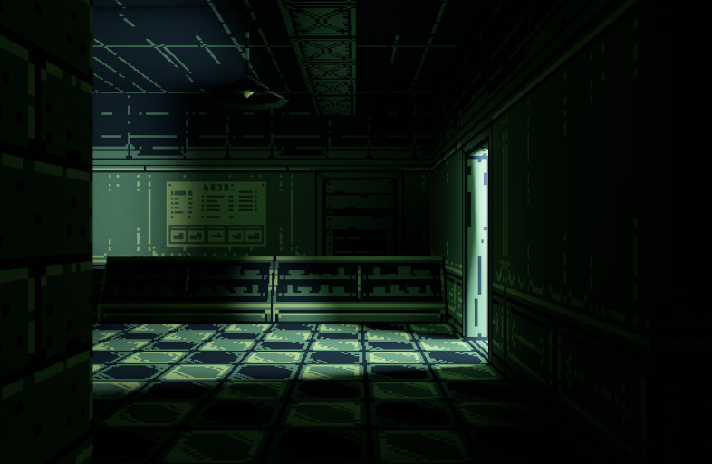
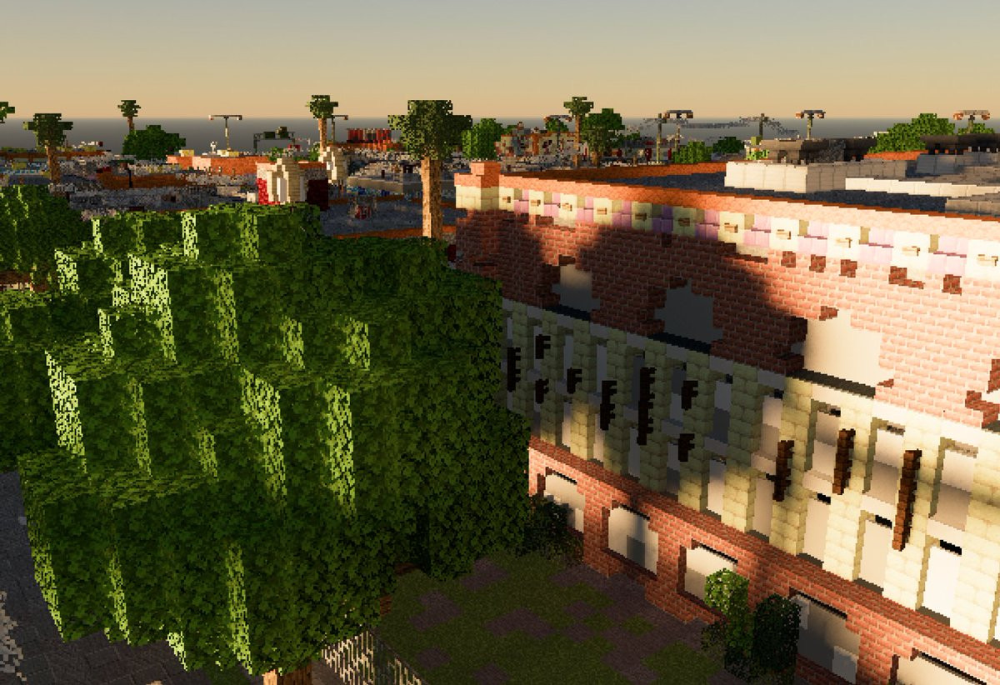
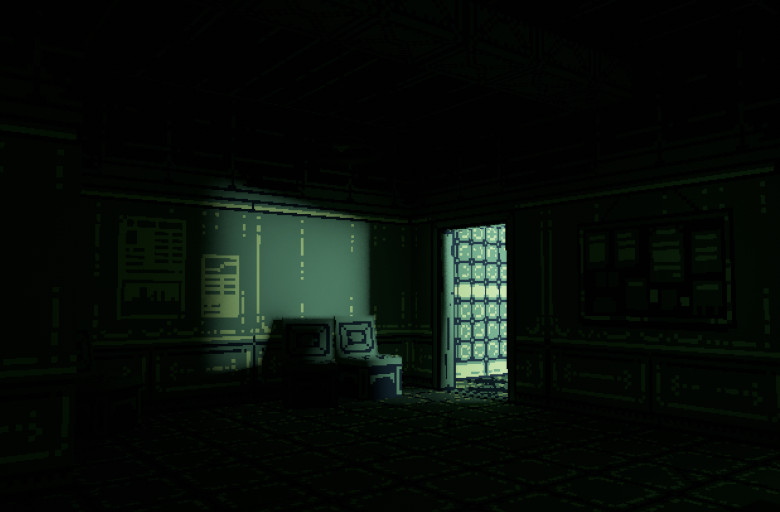
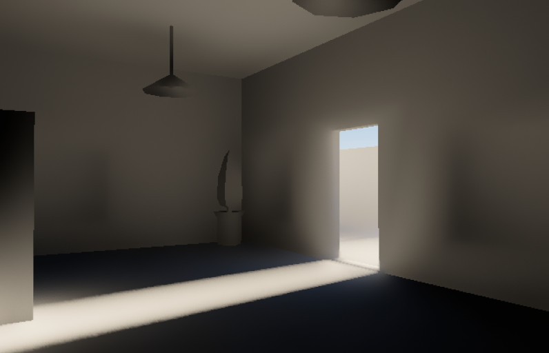
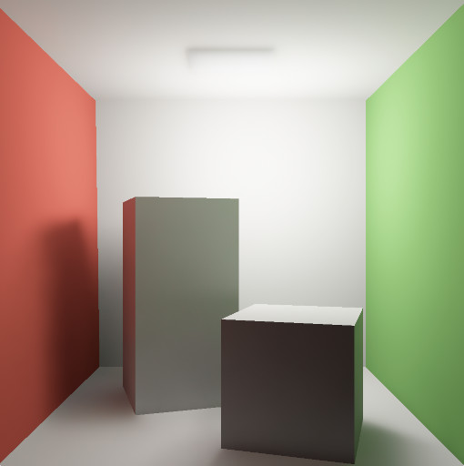

# Strolle

Strolle (from _strålspårning_) is a real-time renderer with support for dynamic
global illumination:

<p align="center">
  
</p>

Our goal is to experiment with modern real-time lightning techniques such as
ReSTIR and see how far we can go on consumer hardware (especially the one
without dedicated ray-tracing cores).

Strolle comes integrated with [Bevy](https://bevyengine.org/), but can be also
used on its own (through `wgpu`).

Status: Experimental, no official release yet (see the demo below, though!).    
Platforms: Windows, Mac & Linux.

## Gallery

<p align="center">
  
</p>

<p align="center">
  
</p>

<p align="center">
  
</p>

<p align="center">
  
</p>

## Examples

### Dungeon

``` shell
$ cargo run --release --example demo
```

Shows a dungeon tech demo, as in the example above.

Use WASD to move and mouse to navigate the camera - extra controls include:

- F: Toggle flashlight,
- H/L: Adjust sun's azimuth,
- J/K: Adjust sun's altitude,
- T: Remove textures,
- 1: Switch camera back to the default mode,
- 2: Show direct lightning only,
- 3: Show indirect diffuse lightning only,
- 4: Show indirect specular lightning only,
- 9: Switch camera to a path-traced reference mode (slow),
- 0: Switch camera to Bevy's renderer,
- ;: Toggle camera's controls on/off - useful for taking screenshots.

Model thanks to:    
https://sketchfab.com/3d-models/low-poly-game-level-82b7a937ae504cfa9f277d9bf6874ad2

### Cornell Box

``` shell
$ cargo run --release --example cornell
```

## Using with Bevy

(currently supported Bevy version: 0.12.1)

1. Add Strolle to your dependencies:

    ``` toml
    [dependencies]
    bevy_strolle = { git = "https://github.com/patryk27/strolle" }
    ```

2. Add a patch to work-around [a bug in Naga](https://github.com/gfx-rs/naga/issues/2373):

    ``` toml
    [patch."crates-io"]
    naga = { git = "https://github.com/Patryk27/naga", branch = "v0.13.0-strolle" }
    ```

3. Setup & enjoy!

    ```rust
    App::new()
        /* ... */
        .add_plugins(StrollePlugin);

    commands
        .spawn(Camera3dBundle {
            camera_render_graph: CameraRenderGraph::new(
                bevy_strolle::graph::NAME,
            ),
            camera: Camera {
                hdr: true,
                ..default()
            },
            ..default()
        });
    ```

Note that at the moment Strolle is not optimized well towards higher
resolutions - especially on non-high-end GPUs it's recommended to stick to
~800x600 and upscale the camera (see the `demo.rs` here).

There are some tricks that Strolle could employ to support higher resolutions in
the future, though.

## Roadmap

- better denoising for direct lightning
- support for normal mapping
- support for ReSTIR GI validation
- support for importance sampling emissive materials
- support for multi-bounce global illumination
- (better) support for specular materials
- (better) support for higher resolutions
- (better) support for lots of lights

## Algorithms

Notable algorithms implemented in Strolle include:

- [ReSTIR DI](https://research.nvidia.com/sites/default/files/pubs/2020-07_Spatiotemporal-reservoir-resampling/ReSTIR.pdf)
- [ReSTIR GI](https://d1qx31qr3h6wln.cloudfront.net/publications/ReSTIR%20GI.pdf)
- [ReBLUR](https://link.springer.com/chapter/10.1007/978-1-4842-7185-8_49)
- [A Scalable and Production Ready Sky and Atmosphere Rendering Technique](https://sebh.github.io/publications/egsr2020.pdf)
- [SVGF](https://research.nvidia.com/publication/2017-07_spatiotemporal-variance-guided-filtering-real-time-reconstruction-path-traced)

## License

MIT License

Copyright (c) 2022-2023 Patryk Wychowaniec & Jakub Trąd
