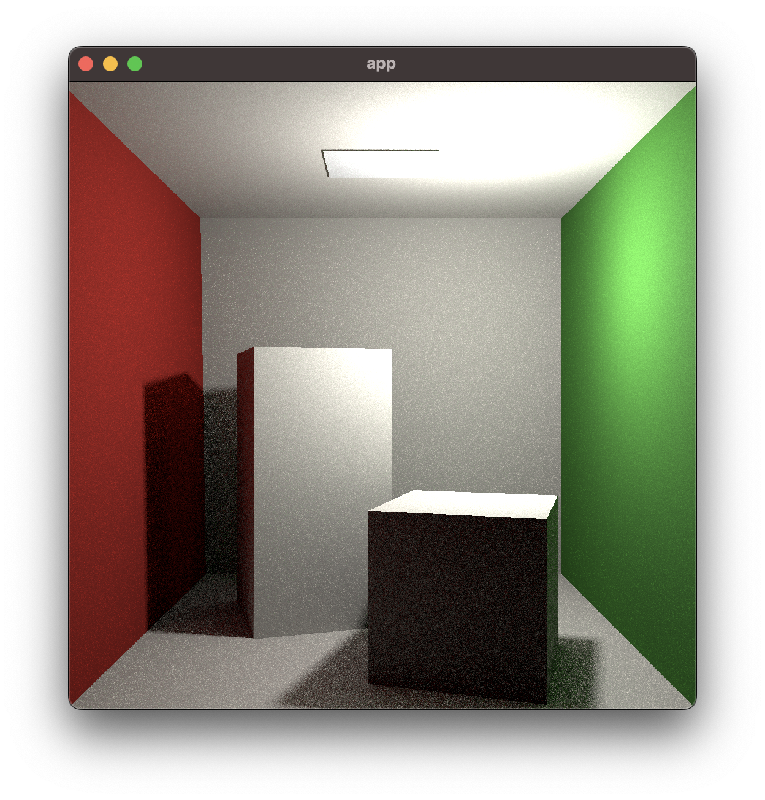
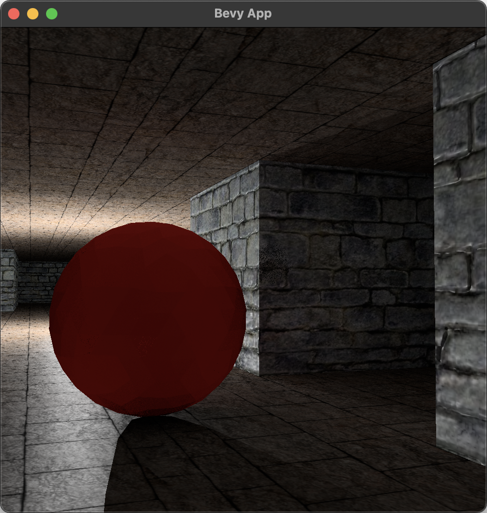

# strolle

Strolle (coming from _strålspårning_) is an experimental real-time renderer that
supports global illumination:

<p align="center">
  
</p>

Our goal is to create an engine that is able to produce a good-looking image on
a consumer GPU without having to rely on hardware ray-tracing capabilities.

Strolle comes integrated with [Bevy](https://bevyengine.org/), but can be also
used on its own (through `wgpu`).

Status: work in progress, no official release yet; examples below should work on
Windows, Mac & Linux (with WebGPU support possible in the future).

## Examples

Before running any example, run (just once):

``` shell
$ cargo build-shaders
```

### Cornell

``` shell
$ cargo run --release --example cornell
```

Shows the (in)famous Cornell Box:

<p align="center">
  
</p>

Use Ctrl + mouse to move.

### Dungeon

``` shell
$ cargo run --release --example dungeon
```

Shows a little dungeon tech demo, with textures, normal mapping and whatnot:

<p align="center">
  
</p>

Use WASD to move, mouse to navigate the camera; extra controls include:

- 1: Switch camera to the default mode,
- 2: Switch camera to a direct-lightning-only mode,
- 3: Switch camera to a indirect-lightning-only mode,
- 4: Switch camera to a normal-only mode,
- 5: Switch camera to a bvh-heatmap mode,
- 0: Switch camera to use Bevy's renderer,
- Semicolon: Toggle camera's controls on/off; useful for taking screenshots.

## Debugging

Strolle is able to print lots of debugging information, including metrics; for
instance this:

``` shell
RUST_LOG=bevy=info,strolle=trace STROLLE_METRIC_THRESHOLD=1ms cargo run --release --example dungeon
```

... will print all actions (e.g. updating BVH) that took more than one
millisecond to complete.
