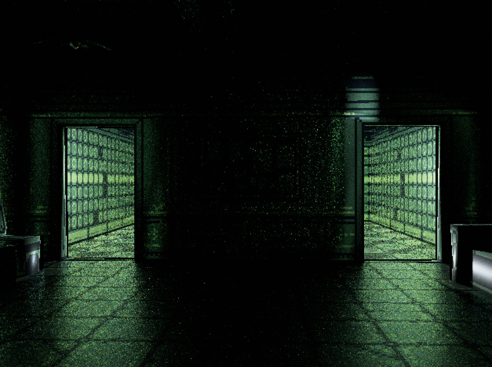

# Strolle

Strolle (from _strålspårning_) is a real-time renderer with support for dynamic
global illumination:

<p align="center">
  
</p>

Strolle's goal is to experiment with modern real-time lighting techniques such
as ReSTIR and see how far we can go on consumer hardware, especially the one
_without_ dedicated ray-tracing cores.

Strolle comes integrated with [Bevy](https://bevyengine.org/), but can be also
used on its own (through `wgpu`).

Status: Abandoned, I've moved on to other things; feel free to fork and/or ping
me if you're interested in details as to how this engine works.

* [Gallery](#gallery)
* [Examples](#examples)
* [Usage](#usage)
* [Roadmap](#roadmap)

## Gallery

<p align="center">
  
</p>

<p align="center">
  
</p>

<p align="center">
  
</p>

(note that currently there's no denoiser for specular lighting)

## Examples

### Dungeon

``` shell
$ cargo run --release --example demo
```

Shows a dungeon tech demo, as in the example above.

Use WASD to move, mouse to navigate the camera, and:

- H/L: Adjust sun's azimuth,
- J/K: Adjust sun's altitude,
- F: Toggle flashlight on/off,
- M: Toggle diffuse/specular materials,
- T: Remove textures,
- 1: Show the final, composed image¹ (default),
- 2: Show direct-diffuse lighting only¹,
- 3: Show direct-specular lighting only¹,
- 4: Show indirect-diffuse lighting only¹,
- 5: Show indirect-specular lighting only¹,
- 8: Show BVH heatmap,
- 9: Switch camera to a path-traced reference mode (slow),
- 0: Switch camera to Bevy's renderer,
- ;: Toggle camera's controls on/off - useful for taking screenshots.

¹ press the same key again to toggle denoising on/off

Model thanks to:    
https://sketchfab.com/3d-models/low-poly-game-level-82b7a937ae504cfa9f277d9bf6874ad2

### Cornell Box

``` shell
$ cargo run --release --example cornell
```

## Usage

### Bevy

Currently supported Bevy version: 0.12.1.

1. Add Strolle to your dependencies:

    ``` toml
    [dependencies]
    bevy_strolle = { git = "https://github.com/patryk27/strolle" }
    ```

2. Add a patch to work-around [a bug in Naga](https://github.com/gfx-rs/naga/issues/2373):

    ``` toml
    [patch."crates-io"]
    naga = { git = "https://github.com/Patryk27/naga", branch = "v0.13.0-strolle" }
    ```

3. Setup & enjoy!

    ```rust
    App::new()
        /* ... */
        .add_plugins(StrollePlugin);

    commands
        .spawn(Camera3dBundle {
            camera_render_graph: CameraRenderGraph::new(
                bevy_strolle::graph::NAME,
            ),
            camera: Camera {
                hdr: true,
                ..default()
            },
            ..default()
        });
    ```

Note that Strolle completely overrides Bevy's camera graph, so you can't use a
Strolle camera together with Bevy's effects such as bloom or TAA - fragment and
vertex shaders won't work as well.

Also, Strolle is not optimized well towards higher resolutions - on non-high-end
GPUs, it's recommended to stick to ~800x600 and upscale the camera instead (see
the `demo.rs` here).

## Roadmap

https://github.com/Patryk27/strolle/issues?q=is%3Aissue+is%3Aopen+label%3AC-bug%2CC-feature

## Algorithms

Notable algorithms implemented in Strolle include:

- [ReSTIR DI](https://research.nvidia.com/sites/default/files/pubs/2020-07_Spatiotemporal-reservoir-resampling/ReSTIR.pdf)
- [ReSTIR GI](https://d1qx31qr3h6wln.cloudfront.net/publications/ReSTIR%20GI.pdf)
- [SVGF](https://research.nvidia.com/publication/2017-07_spatiotemporal-variance-guided-filtering-real-time-reconstruction-path-traced)
- [A Scalable and Production Ready Sky and Atmosphere Rendering Technique](https://sebh.github.io/publications/egsr2020.pdf)

## License

MIT License

Copyright (c) 2022 Patryk Wychowaniec & Jakub Trąd
