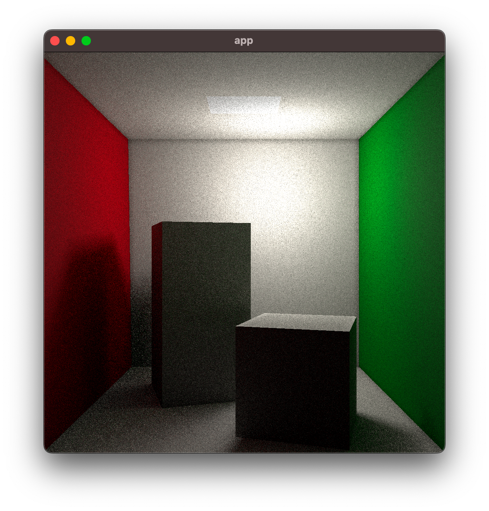
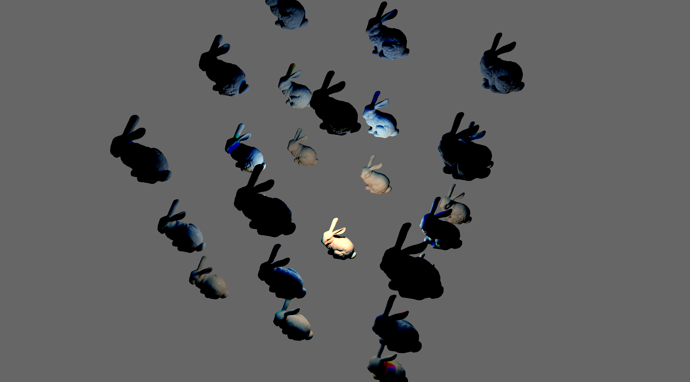
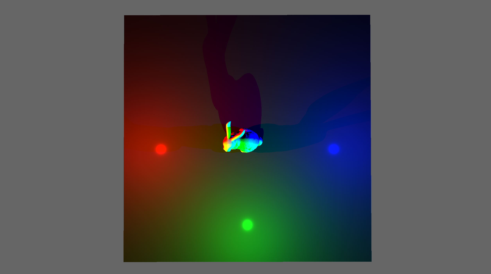
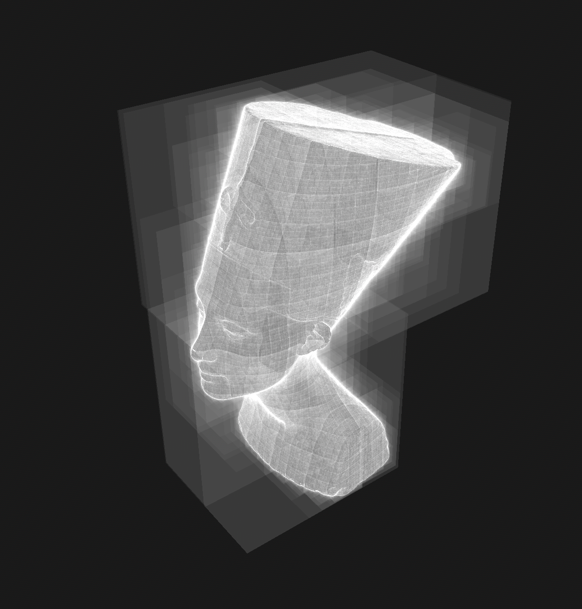

# strolle

Strolle (from _strålspårning_) is a real-time raytracing engine written entirely
in Rust, running on CPU & GPU:





It comes integrated with [Bevy](https://bevyengine.org/), but can be also used
on its own (within `wgpu`).

Status: work in progress, no official release yet; examples below should work on
Windows, Mac & Linux (with WebGPU support possible in the future).

## Examples

Before running any example, please execute (just once):

``` shell
$ cargo build-shaders
```

### Cameras

``` shell
$ cargo run --release --example cameras
```

Shows support for multiple cameras - the left one is rasterized, while the right
one is raytraced.

### Cubes

``` shell
$ cargo run --release --example cubes
```

Shows a few cubes rotating around the origin; use keyboard & mouse to move the
camera.

### Glass

``` shell
$ cargo run --release --example glass
```

Shows support for refraction; use keyboard & mouse to move the camera.

### Instancing

``` shell
$ cargo run --release --example instancing
```

Shows support for hierarchical BVH - there's 100 bunnies * 69k polygons per each
bunny; use keyboard & mouse to move the camera.

### Models

``` shell
$ cargo run --release --example models
```

Shows support for complex geometry (from a few thousand to a few hundred
thousand triangles); use left and right arrows to change models, use keyboard &
mouse to move the camera.

Models thanks to:
- https://github.com/alecjacobson/common-3d-test-models
- https://github.com/RayMarch/ferris3d

### Nefertiti

``` shell
$ cargo run --release --example nefertiti
```

Renders a 2 million-polygon head of Nefertiti with some dynamic lightning; use
keyboard & mouse to move the camera.

(note that model takes a few seconds to appear.)

Model thanks to: https://www.cs.cmu.edu/~kmcrane/Projects/ModelRepository/.

### Textures

``` shell
$ cargo run --release --example textures
```

## Options

`strolle-models/src/lib.rs` contains a constant called `ENABLE_AABB` - if you
enable it (and re-generate the shaders), the raytracer will draw BVH bounding
boxes instead of the triangles; can be fun to browse!


